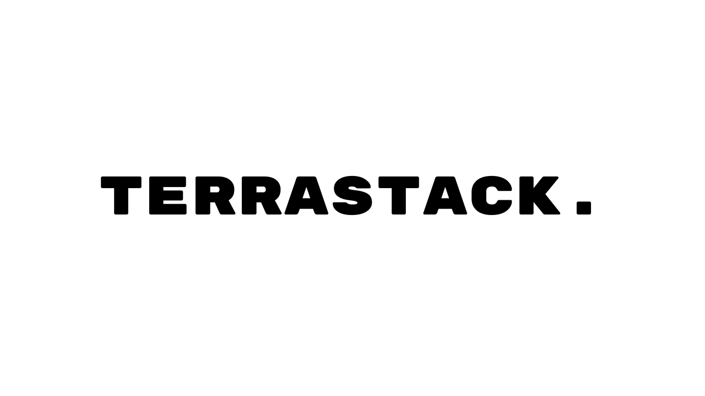

# Terrastack


A modern, full-stack application template built with a Next.js frontend, a .NET 10 Web API, and PostgreSQL. It is geared toward production-ready web applications that need strong frontend SEO, secure same-origin backend integration, and a backend structure that stays maintainable as the application grows.

Standards and additional docs are in [`docs/`](docs/README.md).

## Open Source License

This project is licensed under the MIT License. See [`LICENSE`](LICENSE).

What this means:
- Developers and organizations can use, modify, and distribute this code in open source or commercial projects.
- Teams can use it as a foundation for structured, production-minded cloud software without legal friction.
- The license keeps attribution requirements simple while enabling fast adoption, internal platform reuse, and long-term maintainability.

## Start Here (Quick Setup)

If you are new to this repo, use this order:

1. Read [`docs/start-here.md`](docs/start-here.md) for the fastest setup path.
2. Pick one run mode:
   - Hot reload development: run frontend/backend locally and run only PostgreSQL in Docker.
   - Full local Docker environment: run frontend/backend/postgres together with `docker-compose.yml`.
3. Use deeper docs only when needed:
   - Deploy to AWS: [`DEPLOY.windows.md`](DEPLOY.windows.md) (Windows) or [`DEPLOY.md`](DEPLOY.md) (Bash)
   - Infra state recovery script: [`infra/dev/README.md`](infra/dev/README.md)

## Documentation Hierarchy

- Level 1 (fastest): [`docs/start-here.md`](docs/start-here.md)
- Level 2 (local development reference): this README
- Level 3 (deployment and infrastructure): [`DEPLOY.windows.md`](DEPLOY.windows.md), [`DEPLOY.md`](DEPLOY.md), [`infra/dev/README.md`](infra/dev/README.md)
- Level 4 (project context and conventions): [`docs/development-standards.md`](docs/development-standards.md), [`docs/features.md`](docs/features.md)

API scaffolding from YAML:
- [`docs/api-scaffolding.md`](docs/api-scaffolding.md)

## Core Components Used

### Frontend
* **Next.js App Router** - Server-first React framework for routing, rendering, and metadata
* **React 18** - Component model used by the Next.js frontend
* **Tailwind CSS** - Utility-first CSS framework for responsive design
* **Route Handlers + Metadata API** - Same-origin API proxying, sitemap, robots, manifest, and social metadata

### Backend
* **.NET 10 Web API** - High-performance backend using a controller/service pattern
* **Entity Framework Core** - Object-relational mapping
* **PostgreSQL** - Robust, open-source database
* **Swagger/OpenAPI** - API documentation

### Infrastructure
* **Docker** - Containerization for database service
* **Node.js standalone runtime** - Production runtime for the Next.js frontend image

## Architecture Overview

- **Frontend:** `src/frontend` is a Next.js App Router application. UI routes, metadata, and route handlers live under `src/frontend/src/app`, reusable UI lives under `src/frontend/src/components`, and shared configuration/helpers live under `src/frontend/src/lib`.
- **Frontend-to-backend integration:** the browser talks to the Next.js app first. Server-side route handlers under `src/frontend/src/app/api/backend` proxy requests to the .NET API so backend origins and internal URLs stay off the client.
- **Backend:** `src/backend/API` follows a simple controller pattern. Controllers handle HTTP concerns, services contain business logic, `Data` owns EF Core access and migrations, and `Models` contains persistence/domain entities.
- **Contracts:** request and response models can live separately from EF entities so the API surface can evolve without leaking persistence details across layers.

## Project Structure
```
.
|- src/
|  |- frontend/                         # Next.js frontend
|  |  |- public/                        # Static assets
|  |  |- src/
|  |  |  |- app/                        # App Router pages, layouts, metadata, route handlers
|  |  |  |- components/                 # Reusable React UI
|  |  |  |- config/                     # Frontend configuration
|  |  |  |- lib/                        # Shared frontend config/helpers
|  |  |  |- pages/                      # Additional frontend page entry points when needed
|  |  |  `- types/                      # Shared TypeScript types
|  |  |- tests/                         # Playwright integration tests
|  |  |- Dockerfile                     # Frontend container build
|  |  `- next.config.mjs                # Next.js runtime and security config
|  `- backend/                          # .NET backend
|     |- API/
|     |  |- Controllers/                # MVC controllers for HTTP endpoints
|     |  |- Contracts/                  # Request/response DTOs
|     |  |- Data/                       # DbContext and EF Core migrations
|     |  |- Models/                     # Persistence/domain entities
|     |  |- Services/                   # Business logic and workflows
|     |  `- Program.cs                  # Composition root and middleware setup
|     `- API.Tests/                     # Backend integration and API tests
|- infra/                               # Terraform infrastructure
|  |- dev/                              # Dev environment stack (*.tf)
|  |- prod/                             # Prod environment stack (*.tf)
|  `- modules/                          # Reusable Terraform modules
|- docs/                                # Documentation
|- scripts/                             # Automation/scaffolding scripts
|- docker-compose.yml                   # Full local stack (frontend+backend+db+pgadmin)
|- docker-compose-db.yml                # DB-only local stack
|- Makefile                             # Development automation
|- export.ps1                           # Windows export script
|- export.sh                            # Mac/Linux export script
`- README.md                            # This file
```

## Prerequisites
- Docker and Docker Compose
- Node.js 18+ (for local development)
- .NET 10 SDK (for local development)

## Configuration

**Frontend** (`src/frontend/.env.local`):
```env
NEXT_PUBLIC_SITE_NAME=Terrastack
NEXT_PUBLIC_SITE_URL=http://localhost:3000
BACKEND_INTERNAL_URL=http://localhost:5000
```

**Runtime environment variables** (project root `.env`):
```env
APP_NAME=
SITE_NAME=Terrastack
SITE_URL=http://localhost:3000
POSTGRES_DB=app
POSTGRES_USER=postgres
POSTGRES_PASSWORD=change-me
POSTGRES_PORT=5332
DB_HOST=postgres
DB_PORT=5432
DB_AUTO_MIGRATE=true
BACKEND_INTERNAL_URL=http://backend:5000
PGADMIN_DEFAULT_EMAIL=admin@local.dev
PGADMIN_DEFAULT_PASSWORD=change-me
PGADMIN_PORT=5050
```

Important: Docker Compose reads `.env` (not `.env.example`).
Compose uses `APP_NAME` to build container names. If `APP_NAME` is blank or unset, Compose uses the fallback `app` (for example `app-postgres`).
You can copy the template with `cp .env.example .env` (or create `.env` manually on Windows).

Variable usage:
- `POSTGRES_DB`, `POSTGRES_USER`, `POSTGRES_PASSWORD`: used by Postgres container and API connection string.
- `DB_HOST`, `DB_PORT`: used by API connection string to reach Postgres.
- `SITE_NAME`, `SITE_URL`: used by the Next.js frontend for page metadata, social previews, and canonical URLs.
- `BACKEND_INTERNAL_URL`: used by the Next.js server-side proxy in `src/frontend/src/app/api/backend` to reach the backend without exposing the backend origin to browsers.
- `APP_NAME`: used by Docker Compose for container naming.
- `PGADMIN_DEFAULT_EMAIL`, `PGADMIN_DEFAULT_PASSWORD`: used to log in to pgAdmin UI.

## Database Setup

### Database Configuration
PostgreSQL configuration comes from your project root `.env`:
- `POSTGRES_DB`
- `POSTGRES_USER`
- `POSTGRES_PASSWORD`
- `POSTGRES_PORT` (host port mapping)

### Docker Compose Files: Which One to Use

| File | What it starts | Use it when | Command |
|---|---|---|---|
| `docker-compose.yml` | `postgres` + `backend` + `frontend` | You want to run the entire environment in Docker locally (closest to a full local deploy). | `docker-compose up --build` |
| `docker-compose-db.yml` | `postgres` only | You are running frontend and backend with hot reload on your machine and only need the database in Docker. | `docker-compose -f docker-compose-db.yml up` |

### Tear Down + Rebuild From Scratch

Use these scripts from the project root to verify a clean Docker setup end-to-end:

```powershell
# Full stack: postgres + backend + frontend + pgadmin
.\scripts\docker-reset.ps1 full

# DB-only stack: postgres + pgadmin
.\scripts\docker-reset.ps1 db
```

```bash
# Full stack: postgres + backend + frontend + pgadmin
./scripts/docker-reset.sh full

# DB-only stack: postgres + pgadmin
./scripts/docker-reset.sh db
```

Both scripts run:
1. `down -v --remove-orphans` to remove containers and volumes for that compose file.
2. `up -d` (or `up -d --build` for full mode) to recreate everything cleanly.

### Running Only the Database (for hot reload development)

**Start the database (run from project root):**
```sh
docker-compose -f docker-compose-db.yml up
```

This also starts pgAdmin.

Note: Add `-d` flag to run in detached mode (background): `docker-compose -f docker-compose-db.yml up -d`

**Tear down database (to recreate empty DB, run from project root):**
```sh
docker-compose -f docker-compose-db.yml down -v
```

Note: `down -v` permanently deletes all PostgreSQL and pgAdmin volume data for this compose project.

### Running the Entire Environment in Docker

**Start all services (frontend, backend, database):**
```sh
docker-compose up --build
```

**Stop all services:**
```sh
docker-compose down
```

### pgAdmin (included in Docker Compose)

- URL: `http://localhost:5050`
- Login email: `PGADMIN_DEFAULT_EMAIL` from `.env`
- Login password: `PGADMIN_DEFAULT_PASSWORD` from `.env`
- Database host inside pgAdmin: `postgres`
- Database port inside pgAdmin: `5432`
- Database name: `POSTGRES_DB` from `.env`
- DB user/password: `POSTGRES_USER` / `POSTGRES_PASSWORD` from `.env`

If no server is pre-listed in pgAdmin, create one:
- Name: `Local Postgres`
- Host name/address: `postgres`
- Port: `5432`
- Maintenance DB: value of `POSTGRES_DB` from `.env`
- Username: value of `POSTGRES_USER` from `.env`
- Password: value of `POSTGRES_PASSWORD` from `.env`

### Keeping PostgreSQL Schema In Sync (EF Core Migrations)

The API now uses EF Core migrations to keep schema changes in sync.

- Startup auto-migration:
  - Enabled by default in development (`Database:AutoMigrate=true`)
  - Can be overridden with `DB_AUTO_MIGRATE=true|false`
- In `docker-compose.yml`, backend sets `DB_AUTO_MIGRATE=true` so schema updates apply on container start.

When you change models, run:

```powershell
dotnet ef migrations add <MigrationName> --project src/backend/API/API.csproj --startup-project src/backend/API/API.csproj --output-dir Data/Migrations
dotnet ef database update --project src/backend/API/API.csproj --startup-project src/backend/API/API.csproj
```

For production, prefer running `dotnet ef database update` in deployment and set:

```env
DB_AUTO_MIGRATE=false
```

### One-command verification script (Windows PowerShell)

Run this from project root to confirm migrations applied and required tables exist using your `.env` values:

```powershell
powershell -ExecutionPolicy Bypass -File .\scripts\verify-db-sync.ps1
```

### Troubleshooting: `28P01 password authentication failed`

If backend logs show:
- `Npgsql.PostgresException ... 28P01: password authentication failed for user ...`

This usually means Postgres data volume was initialized with old credentials.

Option 1 (simplest, deletes local DB data):

```powershell
docker compose -f docker-compose.yml down -v --remove-orphans
docker compose -f docker-compose.yml up -d --build
```

Option 2 (keep data, reset DB user password in-place):

```powershell
$DbUser = docker compose -f docker-compose.yml exec -T postgres printenv POSTGRES_USER
$DbName = docker compose -f docker-compose.yml exec -T postgres printenv POSTGRES_DB
$DbPassword = docker compose -f docker-compose.yml exec -T postgres printenv POSTGRES_PASSWORD

docker compose -f docker-compose.yml exec -T postgres psql -U $DbUser -d $DbName -c "ALTER USER ""$DbUser"" WITH PASSWORD '$DbPassword';"
docker compose -f docker-compose.yml restart backend
```

Quick check:

```powershell
$DbUser = docker compose -f docker-compose.yml exec -T postgres printenv POSTGRES_USER
$DbName = docker compose -f docker-compose.yml exec -T postgres printenv POSTGRES_DB
docker compose -f docker-compose.yml exec -T postgres psql -U $DbUser -d $DbName -c "SELECT current_user;"
```

## Development Workflow

### Install Dependencies
```sh
cd src/frontend && npm install
cd ../backend && dotnet restore
```

### Build Components
```sh
cd src/frontend && npm run build
cd ../backend && dotnet build
```

### Run Services Locally

**Start the database (run from project root):**
```sh
docker-compose -f docker-compose-db.yml up
```

Note: Add `-d` flag to run in detached mode (background): `docker-compose -f docker-compose-db.yml up -d`

**Start the backend (in a new terminal):**
```sh
cd src/backend/API
dotnet run
```

**Start the frontend (in a new terminal):**
```sh
cd src/frontend
npm run dev
```

## API Endpoints

Swagger/OpenAPI docs are generated from the .NET controllers automatically.
Developers do not need to maintain endpoint docs manually.

The current backend uses conventional controllers rather than minimal endpoint modules. Keep HTTP concerns in controllers and business rules in services as the API grows.

- Swagger UI: `http://localhost:5000/swagger`
- OpenAPI JSON: `http://localhost:5000/swagger/v1/swagger.json`

To enable Swagger outside development, set:
```env
ENABLE_SWAGGER=true
```

## Testing

### Frontend Tests
```sh
cd src/frontend
npm run test:unit
```

### Backend Tests
```sh
cd src/backend
dotnet test
```

### Integration Tests (Playwright)

**The full stack (frontend and backend) must be running for integration tests to work.**

Start the database using `docker-compose -f docker-compose-db.yml up -d` from the project root, then start the frontend and backend locally (see [Development Workflow](#development-workflow) above).

**Run integration tests:**
```sh
cd src/frontend
npx playwright install --with-deps
npm run test:integration
```

Playwright is configured to use Chromium and baseURL `http://localhost:3000`. Expand tests by adding more `.spec.ts` files in `src/frontend/tests/`.

## Deployment

Deployment guides:
- Windows PowerShell: [`DEPLOY.windows.md`](DEPLOY.windows.md)
- Bash/macOS/Linux: [`DEPLOY.md`](DEPLOY.md)
- Recover failed/incomplete dev destroys (`import_orphaned_resources.sh`): [`infra/dev/README.md`](infra/dev/README.md)

### Environment Variables
Set the following environment variables for production:
- `ASPNETCORE_ENVIRONMENT=Production`
- `ConnectionStrings__DefaultConnection` - Production database connection

## Optional Make Commands

If you have Make installed, you can use these convenience commands instead of running the commands directly:

```sh
make help          # Show all available commands
make install       # Install all dependencies
make build         # Build all components
make run           # Run all services locally
make stop          # Stop all running services
make clean         # Clean build artifacts and containers

# Individual services
make frontend      # Run Next.js frontend only
make backend       # Run .NET backend only
make postgres      # Run PostgreSQL database only

# Docker commands
make postgres      # Run PostgreSQL database only

# Testing
make test          # Run all tests
make test-frontend # Run frontend tests
make test-backend  # Run backend tests
make test-integration # Run frontend integration tests with Playwright
```

## Exporting Your Project

When you're ready to submit your work, you'll need to create a zip file of your project that excludes build artifacts, dependencies, and personal system data.

### Windows (PowerShell)

Run this command from the project root directory:

```powershell
.\export.ps1
```

### Mac/Linux (Bash)

Run this command from the project root directory:

```sh
chmod +x export.sh
./export.sh
```

This will create a `app.zip` file in the project root that contains only your source code and configuration files, excluding all build artifacts, dependencies, and personal system data.


